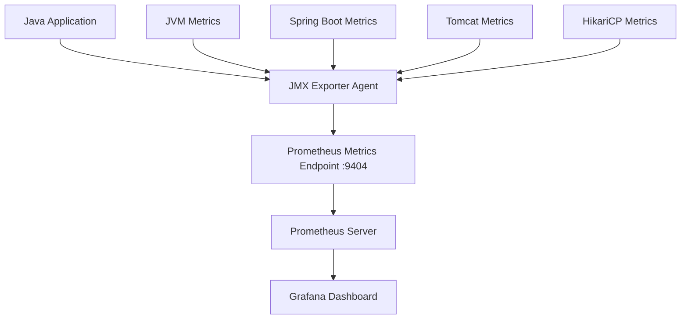

# 📚 JMX Exporter Configuration - WebDiário Platform

## 📋 Visão Geral

O JMX Exporter foi configurado na imagem base Java 21 para expor métricas JVM e de aplicação Spring Boot para o Prometheus. Esta configuração permite monitoramento completo das aplicações Java do ecossistema WebDiário.

## 🎯 Objetivos

- ✅ **Monitoramento JVM**: Métricas de memória, GC, threads e classes
- ✅ **Monitoramento Spring Boot**: Health checks e métricas de aplicação
- ✅ **Monitoramento Tomcat**: Sessões e threads do servidor embarcado
- ✅ **Monitoramento HikariCP**: Pool de conexões de banco de dados
- ✅ **Integração Prometheus**: Exposição de métricas em formato Prometheus

## 🏗️ Arquitetura

### **Componentes Configurados:**



### **Portas Expostas:**
- **8080**: Porta da aplicação Java
- **9404**: Porta do JMX Exporter (métricas Prometheus)

## 🚀 Configuração

### **Arquivos Adicionados:**

1. **`jmx_prometheus_javaagent.jar`**: Agent do JMX Exporter
2. **`jmx_prometheus_config.yml`**: Configuração de métricas
3. **Modificações no Dockerfile**: Cópia dos arquivos e exposição de porta
4. **Modificações no start-java-app.sh**: Configuração do javaagent

### **Variáveis de Ambiente:**

```bash
# Porta do JMX Exporter (padrão: 9404)
JMX_EXPORTER_PORT=9404

# Caminho do arquivo de configuração (padrão: /app/jmx_prometheus_config.yml)
JMX_EXPORTER_CONFIG=/app/jmx_prometheus_config.yml
```

## 🔧 Métricas Disponíveis

### **JVM Metrics:**

| Métrica | Tipo | Descrição |
|---------|------|-----------|
| `jvm_memory_heap_usage` | GAUGE | Uso de memória heap |
| `jvm_memory_nonheap_usage` | GAUGE | Uso de memória non-heap |
| `jvm_gc_collection_count` | COUNTER | Contador de coleta de lixo |
| `jvm_gc_collection_time` | COUNTER | Tempo de coleta de lixo |
| `jvm_threads_current` | GAUGE | Número atual de threads |
| `jvm_threads_daemon` | GAUGE | Número de threads daemon |
| `jvm_threads_peak` | GAUGE | Pico de threads |
| `jvm_classes_loaded` | GAUGE | Classes carregadas |
| `jvm_classes_total_loaded` | COUNTER | Total de classes carregadas |
| `jvm_classes_unloaded` | COUNTER | Total de classes descarregadas |
| `jvm_uptime_seconds` | GAUGE | Tempo de execução da JVM |
| `jvm_start_time_seconds` | GAUGE | Tempo de início da JVM |

### **Spring Boot Metrics:**

| Métrica | Tipo | Descrição |
|---------|------|-----------|
| `spring_boot_health_status` | GAUGE | Status de saúde da aplicação |

### **Tomcat Metrics:**

| Métrica | Tipo | Descrição |
|---------|------|-----------|
| `tomcat_sessions_active` | GAUGE | Sessões ativas |
| `tomcat_threads_current` | GAUGE | Threads atuais |
| `tomcat_threads_max` | GAUGE | Máximo de threads |

### **HikariCP Metrics:**

| Métrica | Tipo | Descrição |
|---------|------|-----------|
| `hikaricp_connections_active` | GAUGE | Conexões ativas |
| `hikaricp_connections_idle` | GAUGE | Conexões ociosas |
| `hikaricp_connections_total` | GAUGE | Total de conexões |

## 📊 Configuração do Prometheus

### **Adicionar ao prometheus.yml:**

```yaml
scrape_configs:
  - job_name: 'webdiario-java-apps'
    static_configs:
      - targets: 
        - 'api-webdiario:9404'
        - 'api-webdiario-security:9404'
        - 'api-webdiario-subscription:9404'
        - 'api-webdiario-event-hub:9404'
    scrape_interval: 15s
    metrics_path: /metrics
```

## 🚀 Uso

### **Execução Automática:**

O JMX Exporter é configurado automaticamente quando a aplicação Java é iniciada. Não é necessária configuração adicional.

### **Verificação Manual:**

```bash
# Verificar se as métricas estão sendo expostas
curl http://localhost:9404/metrics

# Verificar métricas específicas
curl http://localhost:9404/metrics | grep jvm_memory_heap_usage
```

### **Docker Compose:**

```yaml
services:
  api-webdiario:
    image: webdiario/alpine/local/java/21:latest
    ports:
      - "8080:8080"
      - "9404:9404"  # JMX Exporter port
    environment:
      - JMX_EXPORTER_PORT=9404
      - JAR_FILE=/app/app.jar
```

## 🔧 Desenvolvimento

### **Personalização de Métricas:**

Para adicionar métricas customizadas, edite o arquivo `jmx_prometheus_config.yml`:

```yaml
rules:
  # Sua métrica customizada
  - pattern: 'com.webdiario<type=CustomMetrics><>MyMetric'
    name: webdiario_custom_metric
    type: GAUGE
    help: "Custom WebDiário metric"
```

### **Debugging:**

```bash
# Verificar logs do JMX Exporter
docker logs <container_name> | grep "JMX Exporter"

# Verificar se o agent está carregado
docker exec <container_name> jps -l | grep jmx_prometheus
```

## 🆘 Troubleshooting

### **Problemas Comuns:**

1. **Métricas não aparecem no Prometheus:**
   - Verificar se a porta 9404 está exposta
   - Verificar se o Prometheus está configurado para fazer scrape
   - Verificar logs da aplicação

2. **JMX Exporter não inicia:**
   - Verificar se o arquivo `jmx_prometheus_javaagent.jar` existe
   - Verificar permissões do arquivo
   - Verificar se o arquivo de configuração está correto

3. **Métricas específicas não aparecem:**
   - Verificar se a aplicação expõe essas métricas via JMX
   - Verificar a configuração no `jmx_prometheus_config.yml`
   - Verificar se o padrão regex está correto

### **Logs Úteis:**

```bash
# Logs de inicialização
docker logs <container_name> | grep "JMX Exporter"

# Logs de métricas
docker logs <container_name> | grep "metrics"

# Logs de erro
docker logs <container_name> | grep "ERROR"
```

## 🔗 Links Úteis

- **JMX Exporter GitHub**: [https://github.com/prometheus/jmx_exporter](https://github.com/prometheus/jmx_exporter)
- **Prometheus Documentation**: [https://prometheus.io/docs/](https://prometheus.io/docs/)
- **Spring Boot Actuator**: [https://docs.spring.io/spring-boot/docs/current/reference/html/actuator.html](https://docs.spring.io/spring-boot/docs/current/reference/html/actuator.html)

---

**📝 Última Atualização**: Janeiro 2025  
**👨‍💻 Responsável**: Equipe de Desenvolvimento WebDiário  
**🏗️ Projeto**: WebDiário Platform - JMX Exporter  
**🎯 Status**: ✅ **CONFIGURADO E FUNCIONAL**
